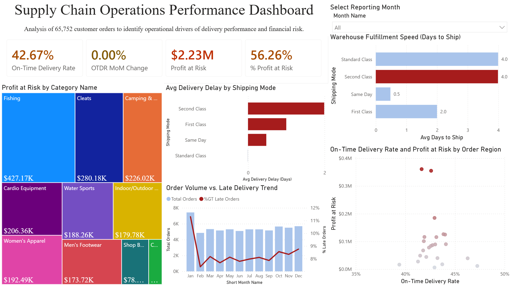

# Supply Chain Operations Performance Dashboard

## Repository Structure

```
├── data/
├── notebooks/
├── powerbi/
├── reports/
├── README.md
└── requirements.txt
```



## Executive Summary

This dashboard was developed to isolate and diagnose systemic delivery bottlenecks affecting global order fulfillment. By combining core operational health metrics with downstream financial risk data, this tool moves beyond high-level performance tracking to pinpoint exactly where internal logistics failures are causing customer friction and revenue vulnerability.

## The Core Operational Problem

Our global **On-Time Delivery Rate (OTDR)** is heavily depressed, sitting at a baseline of **42.67%**. This performance lag has directly placed **$2.23M in revenue at risk**, representing **56.26% of our total profit pipeline**.

Prior reporting lumped all logistics failures together. This project was initiated to isolate the root cause behind these delays by evaluating the relationship between internal warehouse velocity and external shipping tier performance.

---

## Root-Cause Discovery Story

### 1. External Pain Point: The Shipping Mode Paradox

Initial analysis of fulfillment tiers revealed a major anomaly in transit performance:

- **Second Class** shipments exhibit a severe bottleneck, averaging nearly **2 full days of delivery delay**.
- **Standard Class** shipments, by contrast, navigate the transit pipeline with virtually **0 days of average delay**.

### 2. Internal Bottleneck: Warehouse Prioritization Failure

Because carrier performance data was unavailable, an internal vector analysis was conducted by calculating **Warehouse Fulfillment Speed (`Avg Days to Ship`)**—the exact duration between order placement and shipment staging.

The data uncovered a major internal processing misalignment:

- Both Standard Class and Second Class orders sit in the warehouse for an average of **4.0 days** before being passed to a carrier.
- While a 4-day warehouse queue is acceptable for a low-priority _Standard Class_ timeline, it completely breaks the tight fulfillment window promised to a _Second Class_ customer.

**The Actionable Diagnostic:** The delivery crisis is not an external carrier or logistics infrastructure failure. The bottleneck is internal: the warehouse team handles Second Class and Standard Class orders with the identical low priority, automatically forcing Second Class orders into an operational deficit before they even leave the loading dock.

---

## Dashboard Architecture

The reporting interface is structurally divided into three functional zones designed to guide an operations manager from high-level awareness to localized action:

```text
┌────────────────────────────────────────────────────────────────────────┐
│  1. EXECUTIVE HEALTH CAPTION (Top Left)                                │
│     Core KPIs tracking OTDR, Month-over-Month Change, and Profit-at-Risk│
├───────────────────────────────────┬────────────────────────────────────┤
│  2. INTERNAL ROOT CAUSE (Top Right)│ 3. REGIONAL RISK ANALYSIS (Bottom)  │
│     Warehouse fulfillment speed vs.│    Scatter plot mapping regional  │
│     downstream shipping delays.   │    OTDR against financial leakage. │
└───────────────────────────────────┴────────────────────────────────────┘
```
